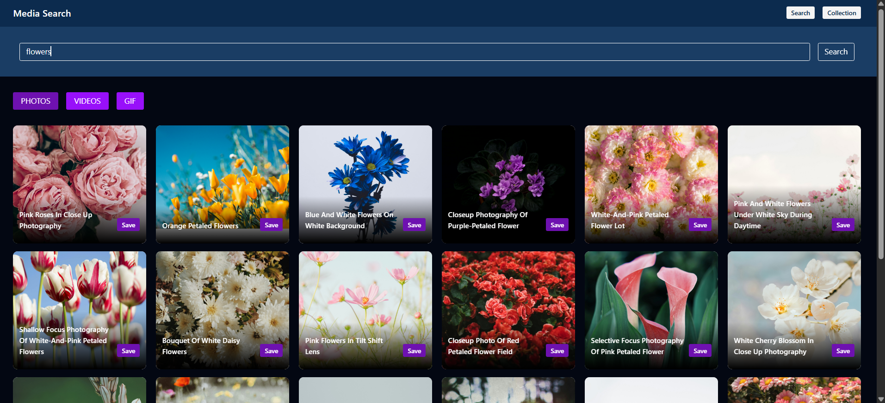
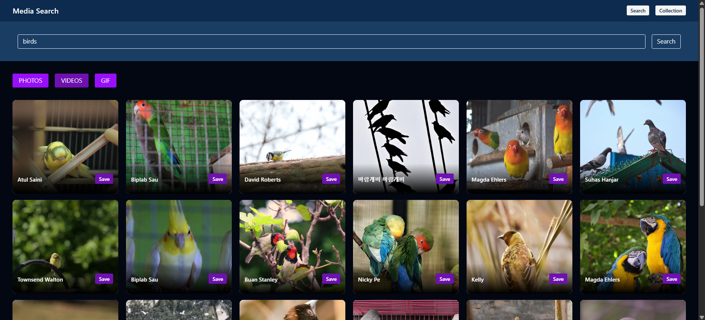
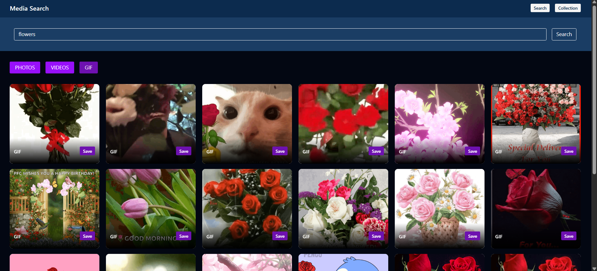
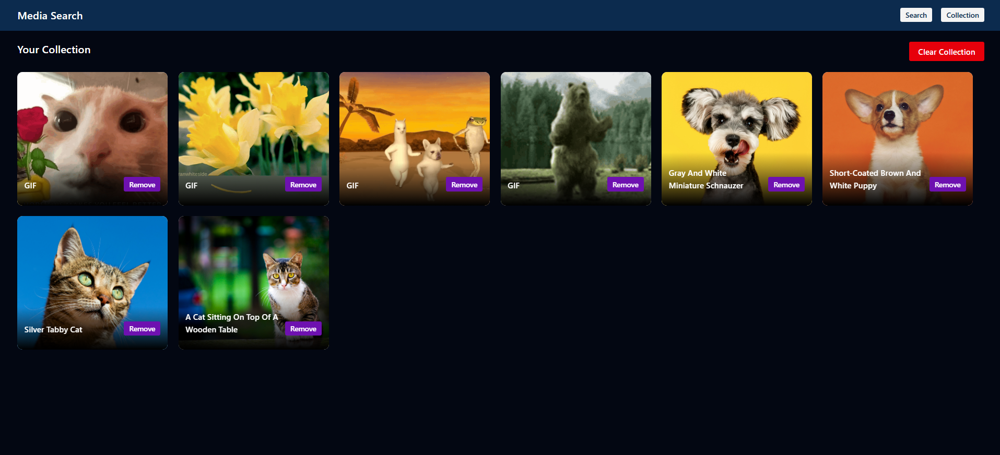

<h3>📸 Media Search App</h3>

A modern and responsive Media Search Application that allows users to search and explore photos, videos, and GIFs in one place. Users can also save their favorite media items to a personal collection and manage them easily.

<h3>📌 Features</h3>
<h3>🔍 Search Media</h3>
Search for any keyword (e.g., nature, cars, cats)
Get results in:
<li>📷 Photos </li>
<li>🎥 Videos </li>
<li>🎞️ GIFs </li>

<h3>📂 Save to Collection</h3>
<li>Save your favorite media items</li>
<li>Access saved items on the Collection Page</li>
<li>Persistent and organized view of saved content</li>

<h3>❌ Remove from Collection</h3>
<li>Remove saved items anytime</li>
<li>Keep your collection clean and updated</li>

<h3>🛠️ Tech Stack</h3>
<li>Frontend: HTML, CSS, JavaScript / React</li>
<li>API: Media APIs (like Unsplash / Pexels / Tenor)</li>
<li>State Management: React Hooks, React Redux Toolkit</li>

<h3>📸 Screenshots</h3>
<li>Photos</li>

<li>Videos</li>

<li>GIFs</li>

<li>Collections</li>

