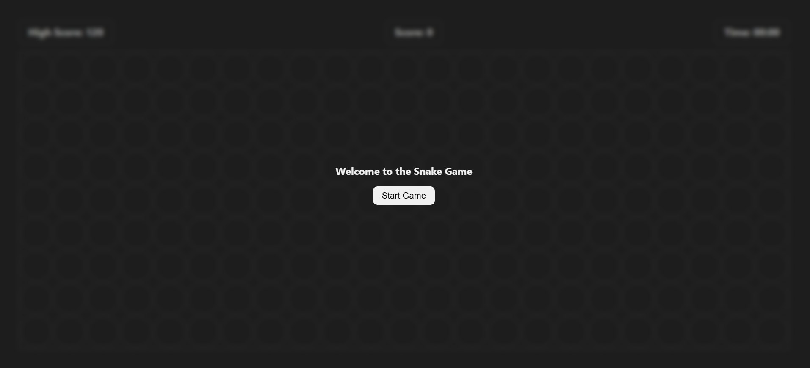
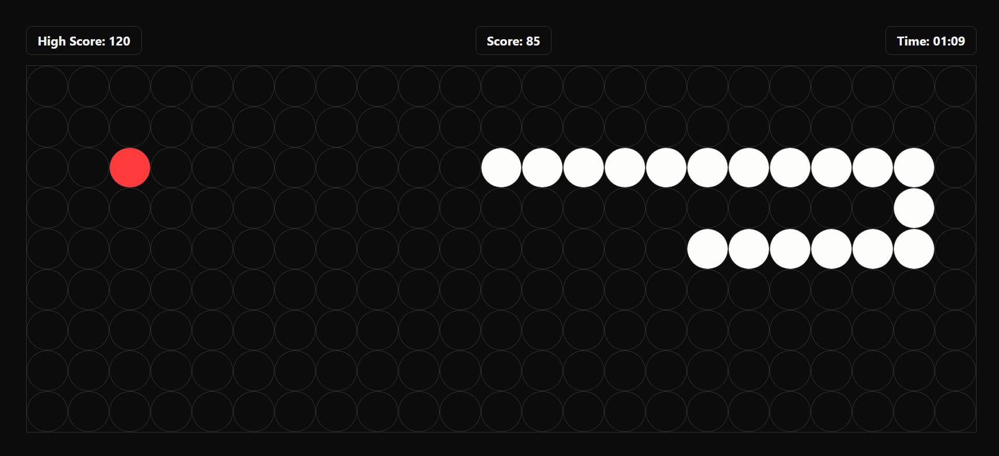
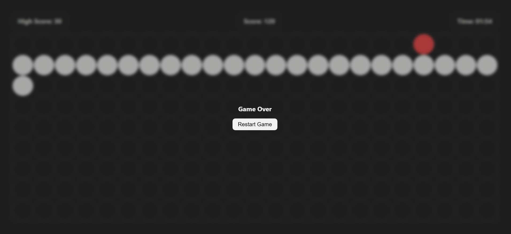

# 🐍 Snake Game (JavaScript)

A simple and interactive **Snake Game** built using **HTML, CSS, and Vanilla JavaScript**. The game runs on a grid-based board where the snake moves, eats food, and grows longer. The game ends when the snake hits the wall.

---

## 🚀 Features

- 🎮 Start and Restart functionality
- 🐍 Snake movement using arrow keys
- 🍎 Random food generation
- 📈 Snake grows when eating food
- 💀 Game over on wall collision
- 🎨 Different color for snake head and body

---

## 🛠️ Tech Stack

- HTML
- CSS
- JavaScript (DOM Manipulation)

---

## 🎯 How to Play

1. Click the **Start Game** button
2. Use arrow keys to control the snake:

   - ⬆️ Up
   - ⬇️ Down
   - ⬅️ Left
   - ➡️ Right

3. Eat the food to grow the snake
4. Avoid hitting the walls
5. Click **Restart** after Game Over

---

## 📂 Project Structure

```
snake-game/
│── index.html
│── style.css
│── script.js
```

---

## ⚙️ Game Logic Overview

- The board is divided into a grid using rows and columns
- The snake is represented as an array of coordinates
- The first element of the array is the **head**
- Each movement:

  - A new head is added in the current direction
  - The last segment is removed (unless food is eaten)

- Food appears randomly on the grid
- Game ends when the snake hits the boundary

---

## 📌 How to Run

1. Clone the repository:

```
git clone <your-repo-link>
```

2. Open `index.html` in your browser

---

## 🙌 Acknowledgement

This project is great for practicing:

- JavaScript fundamentals
- DOM manipulation
- Game logic implementation

---

<h3>📸 Screenshots</h3>



