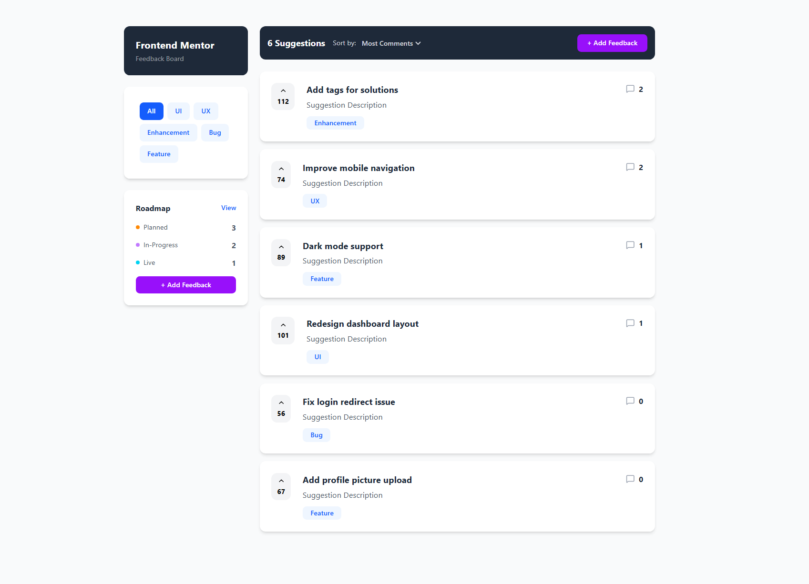
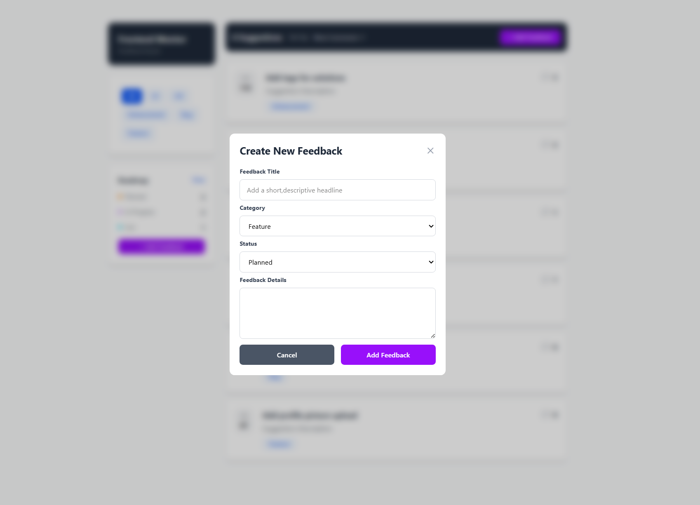
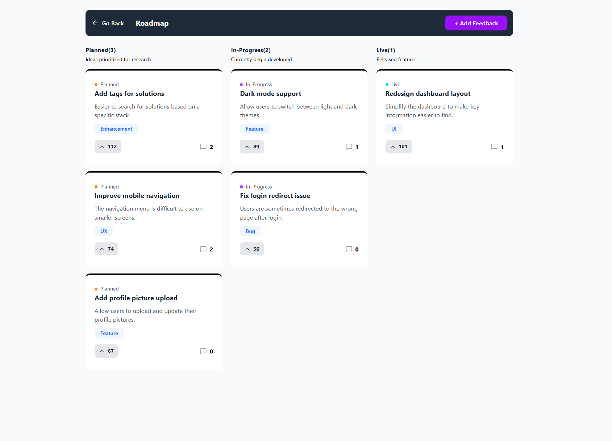

# 🚀 Product Feedback Board

A modern and responsive **Product Feedback Board** built with **React.js**, **Redux Toolkit**, and **Tailwind CSS**. This application allows users to submit, manage, and interact with product feedback through feature requests, comments, upvotes, and roadmap tracking.

---

## ✨ Features

- 📝 Create, edit, and delete feedback suggestions
- 👍 Upvote and remove upvotes from suggestions
- 💬 Add comments to feedback
- 🔍 Filter feedback by category
- 📊 Sort feedback by upvotes and comments
- 🗺️ View roadmap based on feedback status (Planned, In Progress, Live)
- 📱 Fully responsive design for desktop, tablet, and mobile
- ⚡ Centralized state management using Redux Toolkit
- 🧩 Reusable React components and clean project structure

---

## 🛠️ Tech Stack

- React.js
- Redux Toolkit
- React Router DOM
- Tailwind CSS
- JavaScript (ES6+)
- HTML5
- CSS3
- Vite

---

## 📂 Project Structure

```text
src/
├── components/
├── pages/
├── store/
├── data/
├── assets/
├── App.jsx
└── main.jsx
```

---

## 🚀 Getting Started

### Clone the repository

```bash
git clone https://github.com/nehakashyap-1204/Advance-Projects/tree/main/5.%20Product%20Feedback%20App
```

### Navigate to the project

```bash
cd product-feedback-app
```

### Install dependencies

```bash
npm install
```

### Start the development server

```bash
npm run dev
```

### Build for production

```bash
npm run build
```

---

## 📸 Screenshots

<li>🏠 Home Page</li>


<li>📝 Add/Edit Feedback Modal</li>


<li>🗺️ Roadmap Page</li>


---

## 🎯 Learning Outcomes

Through this project, I strengthened my understanding of:

- React Hooks (useState, useEffect, useMemo)
- Redux Toolkit for global state management
- CRUD operations in React
- Dynamic routing with React Router
- Responsive UI development using Tailwind CSS
- Building reusable and maintainable React components

---

## 🔮 Future Improvements

- User Authentication
- Backend integration with Node.js & MongoDB
- Nested replies for comments
- Search functionality
- Pagination
- Dark Mode
- Persistent data storage

---

## 👩‍💻 Author

**Neha Kashyap**

If you found this project helpful, feel free to ⭐ the repository.
