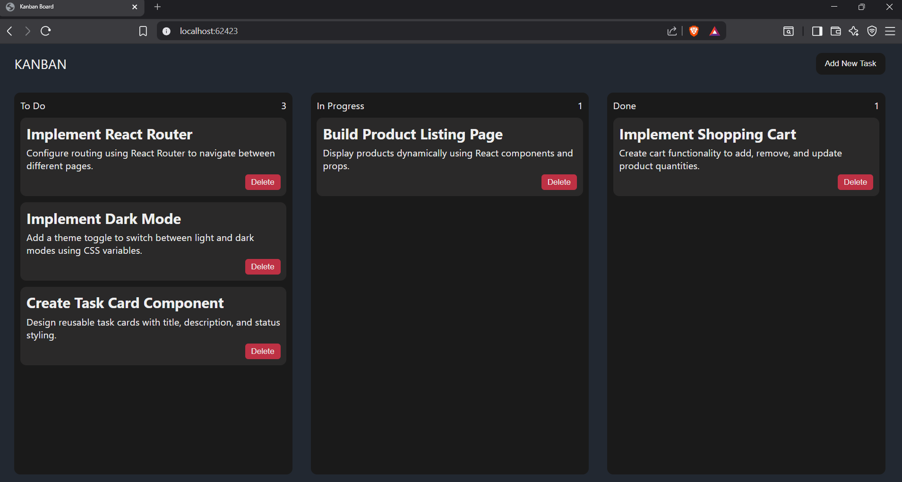
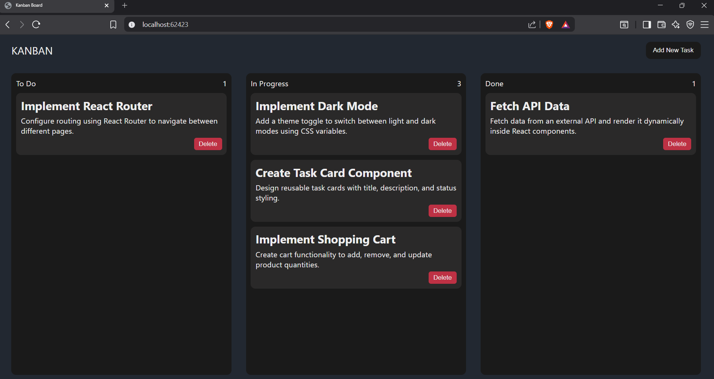
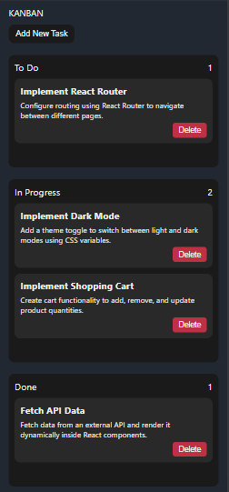
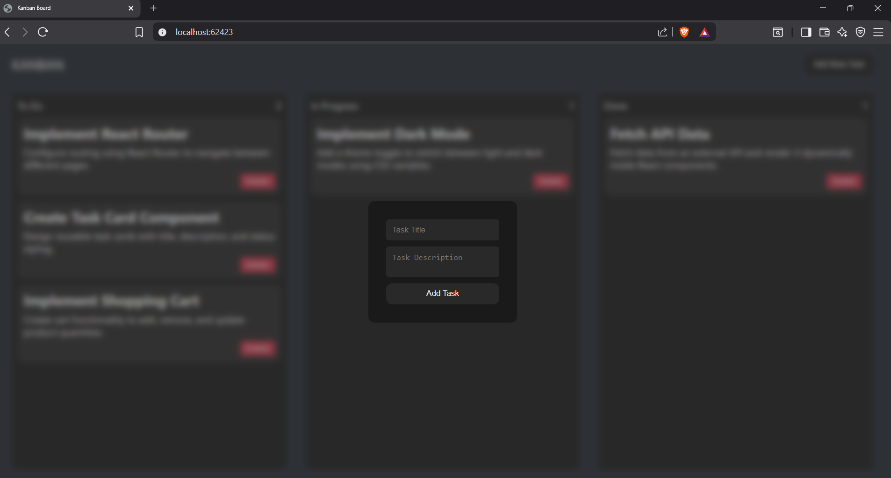

# 🗂️ Kanban Board

A simple and interactive **Kanban Board** built using **HTML, CSS, and JavaScript**.  
This project allows users to manage tasks visually by dragging and dropping them between different workflow columns.

---

## 🚀 Features

- Drag and Drop tasks between columns
- Add new tasks dynamically
- Clean and responsive UI
- Task organization with workflow stages
- Simple and user-friendly design

---

## 📌 Kanban Workflow

The board is organized into the following columns:

- **Backlog** – List of upcoming tasks
- **To Do** – Tasks ready to start
- **In Progress** – Tasks currently being worked on
- **Review** – Tasks waiting for verification or testing
- **Done** – Completed tasks

---

## 🛠️ Technologies Used

- **HTML5** – Structure of the application
- **CSS3** – Styling and responsive layout
- **JavaScript (ES6)** – Drag & drop functionality and task management

## 📸 Project Preview

